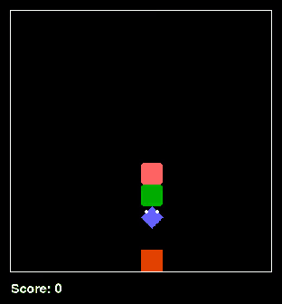

# SnakeAI

## 2539 步满盘通关

这局由 **CNN / MaskablePPO + 头尾可达安全检查**现场推理完成：12×12 棋盘，**2539 步，1410 分，144/144 格**。没有使用固定汉密尔顿环，也没有为这次演示重新训练模型。



GIF 展示从开局到满盘的完整时间范围，4 倍速并抽帧压缩。查看 [正常速度完整 MP4（约 2 分 10 秒，无声）](docs/media/victory-2539.mp4) · [满盘截图](docs/media/victory-final.png) · [对照评测](docs/comparison-report.md)。视频由原游戏渲染器输出，每一步均来自实时模型推理。

### 在 Python 中复现这一局

已验证环境：Windows、Python 3.8.20、CPU、PyTorch 2.0.1、NumPy 1.24.4、Gym 0.21.0、Stable-Baselines3 / sb3-contrib 1.8.0。旧版 Gym 的安装需要兼容的 pip / wheel；本演示请使用单独环境。

```powershell
conda create -n snake-victory python=3.8.20 -y
conda activate snake-victory
cd snakeai/main
python -m pip install pip==23.0.1 setuptools==65.5.0 wheel==0.38.4
python -m pip install -r requirements-victory.txt
python test_cnn_victory.py
```

运行后显示原版游戏窗口，终端打印吃果子、得分与最终验证结果；结束后保留满盘画面，关闭窗口即可退出。若项目内已有 `.snake-runtime/python.exe`，脚本会优先使用它；否则使用当前 Python 环境。Python 运行环境本身未提交进仓库。

```powershell
# 无窗口快速验证；仍执行模型推理
python test_cnn_victory.py --headless
# 加快显示，并在结束后关闭窗口
python test_cnn_victory.py --frame-delay 0.01 --exit-on-finish
```

这局的环境种子是 **210750013**，模型采用 CPU 确定性推理。原训练脚本的全局种子 `114514` 与这局的环境种子不同。脚本内的参考动作仅用于逐步核对，不替代 AI 决策；模型 SHA-256 为 `81f64d949bf5c1a11f73faa8eb599d0137fedfda248e8c51ee9eebf90a05e2a5`。

达到 400 分后，先模拟每个合法动作，再检查蛇头是否仍能到达蛇尾，屏蔽不安全动作；无安全候选时回退到即时合法动作，最后由 CNN 选择。这是辅助决策，**不保证每个种子都能通关**。100 个独立种子的测试中，本地 CNN 配合该检查，确定性推理通关 39 局，采样推理通关 45 局；其余可能碰撞、循环或达到评测步数上限。详情见评测报告。

### 来源与改动

项目源自 [林亦的 snake-ai](https://github.com/linyiLYi/snake-ai)，感谢其游戏环境与强化学习实现。本仓库包含本地训练权重、环境与奖励修改；本次新增通关复现脚本、头尾可达动作筛选和展示录像。上游代码遵循 [Apache-2.0](LICENSE)。仓库原有历史模型与 TensorBoard 日志保留；此次评测没有生成新的训练曲线。

---


[简体中文] | [English](README-EN.md) | [日本語](README_JA.md)

贪吃蛇大师，尝试使用智能体通关贪吃蛇游戏
本项目包含一经典游戏贪吃蛇，一次意外训练生成的通关解法，走汉密尔顿环（有些无赖虽然也能通关），还有就是之前cnn训练的结果，和mlp结果。训练数据也会一并公开并打包上传。
这里提供一个本人训练的模型，下载地址  
https://dlink.host/1drv/aHR0cHM6Ly8xZHJ2Lm1zL3UvcyFBckpVdXJnZURwTHNpNUI3Vkxacm0yYU9fQU9aLXc_ZT1YVk01TUo.zip

### 文件结构

```bash
├───main
│   ├───logs
│   ├───trained_models_cnn
│   ├───sound
│   ├───20231217
│   ├───20231219
│   ├───20231220
│   ├───20231222
│   ├───requirements.txt
│   └───scripts
├───utils
│   └───scripts
```

项目主要包括用于检测GPU的脚本（gpu.py和PyTorch.py），其中几次的训练数据（文件夹名为数字的），logs文件夹为含训练过程的终端文本和数据曲线（使用 Tensorboard 查看）；requirements.txt为anaconda配置文件，
check_gpu_status/ 用于检查 GPU 是否可以被 PyTorch 调用

## 运行指南

本项目基于 Python 编程语言，用到的外部代码库主要包括 Pygame、OpenAI Gym、Stable-Baselines3 等。程序运行使用的 Python 版本为 3.8.16，建议使用 Anaconda 配置 Python 环境。以下为Windows Terminal指令。


### 环境配置

```bash
# 创建 conda 环境，将其命名为SnakeAI并激活环境
conda create -n SnakeAI python=3.8.18
conda activate SnakeAI
```


Windows:

```bash 
# 前往官网下载对应版本的PyTorch。使用 GPU 训练需要手动安装完整版 PyTorch
pip3 install torch torchvision torchaudio --index-url https://download.pytorch.org/whl/cu121

# 运行程序脚本测试 PyTorch 是否能成功调用 GPU
python gpu.py
python PyTorch.py

# 安装外部代码库
pip install -r requirements.txt
```


### 运行训练和测试

项目文件夹下可以直接运行以下指令进行游戏：

```bash
cd [项目上级文件夹]/snake-ai/main
python snake_game.py
```


环境配置完成后，可以在 main/ 文件夹下运行 test_cnn.py 进行测试
```bash
cd "所在目录"
# 运行卷积神经网络模型训练脚本
python train_cnn.py

# 运行模型测试脚本
python test_cnn.py
```

模型权重文件存储在 main/trained_models_cnn/

如果需要重新训练模型，可以在train_cnn.py所在目录下运行此文件。测试脚本均默认调用训练完成后的模型比如ppo_snake_final.zip。如果需要观察不同训练阶段的 AI 表现，可将测试脚本中的 MODEL_PATH 变量修改为其它模型的文件路径。


### 查看曲线

项目中包含了训练过程的 Tensorboard 曲线图，可以使用 Tensorboard 查看其中的详细数据。推荐使用 VSCode 集成的 Tensorboard 插件直接查看，也可以使用传统方法：

```bash
cd "所在目录"
tensorboard --logdir=[上级目录]\snakeai\main\logs --bind_all --reload_interval 60
```

此命令会将 TensorBoard 绑定到所有可用的网络接口（包括公网IP），以便在外网上访问，方便随时随地查看，且每60s自动刷新一次图像。可在网络中的任何设备，浏览器中打开 Tensorboard 服务默认地址 `http://[您的公网IP]:6006/`，即可查看训练过程的交互式曲线图。
