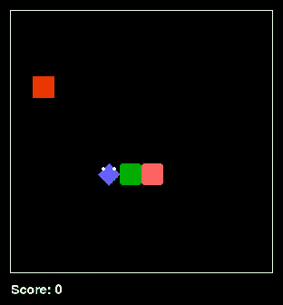

# SnakeAI

基于 [林亦的 snake-ai](https://github.com/linyiLYi/snake-ai)，复现其历史固定种子训练方法，并用自己训练的 CNN 完成 12×12 满盘。

## 1316 步通关全过程



[正常速度完整 MP4（约 69 秒，有声）](docs/media/victory-1316-with-sound.mp4) · [无声版](docs/media/victory-1316.mp4) · [最终画面](docs/media/victory-1316-final.png)

GIF 展示整局过程，2 倍速并抽帧压缩；MP4 保留每步画面。两者由实际模型推理和游戏渲染生成。有声版保留原视频画面和速度，按通关记录同步加入 141 次吃食物音效，并在 144/144 满盘时播放胜利音效。

| 项目 | 设置 / 结果 |
|---|---|
| 模型 | CNN（CnnPolicy）+ MaskablePPO |
| 通关检查点 | 37,000,000 步 |
| 环境种子 | 114514；每次生成食物前重新播种 |
| 动作采样种子 | 114526 |
| 结果 | 1316 步、1410 分、144/144 格 |
| 辅助规则 | 原版即时防撞和反向动作屏蔽；没有 BFS 或汉密尔顿策略 |

这是一局已验证、可复现的成功样本，不代表任意种子或每次采样都能通关。它也不是完全无动作屏蔽的“纯 CNN”。记录动作仅用于核对，演示程序每一步仍现场运行模型。

## 运行通关演示

验证环境：Python 3.8.16 / 3.8.20、PyTorch 2.0.1、NumPy 1.24.4、Gym 0.21.0、SB3 / sb3-contrib 1.8.0、Pygame 2.3.0，CPU 推理。

```powershell
conda create -n snake-victory python=3.8.20 -y
conda activate snake-victory
cd snakeai/main
python -m pip install pip==23.0.1 setuptools==65.5.0 wheel==0.38.4
python -m pip install -r requirements-victory.txt
python test_cnn_114514.py
```

游戏窗口显示过程，终端打印得分，结束后保留满盘画面。若存在 `.snake-runtime/python.exe`，入口会优先使用它，否则使用当前环境；运行环境本身未上传。

```powershell
python test_cnn_114514.py --headless
```

## 本轮训练

2026-09-28 开始的本轮从新权重训练至 **100,007,936 步**，日志训练耗时 **59,498 秒（约 16 小时 32 分）**。固定种子游戏、奖励和基本动作屏蔽来自历史提交 [e16d230b 的 main_fix_seed](https://github.com/linyiLYi/snake-ai/tree/e16d230b3673c265bd975af45b1be326851b5632/main_fix_seed)，并非当前上游随机食物版本。权重由本项目自行训练，不是作者当年的检查点。

32 个并行环境，n_steps=2048，batch_size=512，n_epochs=4，gamma=0.94；学习率从 2.5e-4 降至 2.5e-6，clip_range 从 0.15 降至 0.025。训练入口增加时间戳输出目录、GPU 检查和简洁终端日志。

仓库提供 3700 万步通关检查点、1 亿步最终权重，以及本轮 TensorBoard 日志。模型以 `.zip.parts` 分块保存以适应上传连接，演示入口会自动合并并校验 SHA-256；不包含本地约 4 GB 的全部中间检查点。最终权重不等于已验证通关权重。

```powershell
# 新建一轮训练，需要安装支持本机 GPU 的 PyTorch CUDA 版本
python train_cnn.py
# 查看已上传的本轮训练曲线
python -m tensorboard.main --logdir logs/PPO_1 --host 127.0.0.1
```

`test_cnn.py` 默认使用 3700 万步权重，首局固定采样种子以复现成功路线，之后继续采样。`train_cnn.py` 每次在 `runs/时间戳/` 新建输出，不自动续训。

## 文件说明

- `snakeai/main/test_cnn_114514.py`：独立通关展示入口。
- `snakeai/main/replays/fixed_114514/`：对应环境及核验记录，权重从 trained_models_cnn 自动合并。
- `snakeai/main/snake_game_114514.py`：固定种子游戏。
- `snakeai/main/snake_game_custom_wrapper_cnn.py`：固定种子 CNN 环境。
- `snakeai/main/trained_models_cnn/`：模型与训练文本日志；目录中还保留此前版本的部分历史检查点，不能混为本轮产物。
- `snakeai/main/logs/PPO_1/`：本轮 TensorBoard 数据；其他日志目录为历史数据。

## 早期探索

此前的 2539 步演示用了额外头尾 BFS 筛选，与本页新方案不同。旧演示及其完整配套代码请查看 [旧提交](https://github.com/Tomclanc/SnakeAI/tree/95e1e8f75d0ea5bf693f73e483e7dfb4fc29c13e)，不要将旧脚本与当前权重混用。此前对照评测见 [历史报告](docs/comparison-report.md)。

感谢林亦开源游戏和强化学习实现。上游代码遵循 [Apache-2.0](LICENSE)。

手动合并最终权重：在 `snakeai/main` 执行 `python -c "from model_weights import ensure_model; print(ensure_model('ppo_snake_final.zip'))"`。
